# 🏚️ AI Powered Disaster Response System with MCP Server – Hackathon Project

## 🌍 Overview: Bringing Data Together for Emergency Management

In real-world disasters, response teams need fast, reliable access to multiple sources of information —  
from **damage assessments**, to **travel restrictions**, to **shelter availability**, to **supply chain data**.  

For this hackathon, our team built an **end-to-end solution** to unify these data sources using modern cloud technologies.  
We connected multiple SQL-backed APIs (RedHelpers, SafeBirds), internal state APIs (Travel Route Restrictions),  
and geospatial data (Azure Maps) into a **single conversational experience** powered by **Copilot Studio**.

Our solution demonstrates how emergency managers could quickly query:
- Which homes have been assessed after a wildfire
- Which roads are currently closed or restricted
- Where food and supply resources are available
- And much more — all through natural language inside Microsoft Teams

This project is designed to show what a **connected emergency management ecosystem** could look like  
when data is open, secured, and made discoverable via MCP servers.

---

## 🏚️ This Repository: Home Damage Assessment Website

This repository focuses on **one key part of the overall solution**:  
the **Home Damage Assessment Website** and its supporting API.

Specifically, this repo:
- Hosts a lightweight web front-end for logging and viewing home damage assessment records
- Uses **Azure Data API Builder (DAB)** to generate REST endpoints directly over the SQL database
- Produces an **OpenAPI specification** that documents the API surface
- Demonstrates how this OpenAPI file is imported into **Azure API Management (APIM)**
- Publishes the API as an **MCP server** so it can be consumed by Copilot Studio

---

## 🚀 Project Architecture

1. **SQL Database** – Stores all damage assessment records (location, type, severity, status).
2. **Azure Data API Builder (DAB)** – Generates REST/GraphQL endpoints with minimal configuration.
3. **Azure Static Web Apps** – Serves the front-end that field teams can access from any device.
4. **OpenAPI Spec** – Automatically generated by DAB, used as the contract for APIM.
5. **Azure API Management (APIM)** – Imports the spec, applies auth/policies, and publishes as an MCP server.
6. **Copilot Studio (Teams)** – Consumes the MCP server so users can run natural language queries against live data.

---

## 🗺️ Solution Diagram

<link
  rel="stylesheet"
  href="https://cdnjs.cloudflare.com/ajax/libs/font-awesome/6.5.2/css/all.min.css"
/>

```mermaid
%%{init: {'themeVariables': { 'fontSize': '16px', 'nodeSpacing': 50, 'rankSpacing': 60 }}}%%
flowchart TD
  %% ========= ORGS =========
  subgraph RH["fa:fa-hand-holding-heart RedHelpers"]
    RH_SQL[("fa:fa-database SQL Server")]
    RH_DAB["fa:fa-code DAB + SWA (OpenAPI)"]
    RH_SQL --> RH_DAB
  end

  subgraph SB["fa:fa-store SafeBerts"]
    SB_SQL[("fa:fa-database SQL Server")]
    SB_DAB["fa:fa-code DAB + SWA (OpenAPI)"]
    SB_SQL --> SB_DAB
  end

  %% ========= DOEM =========
  subgraph DOEM["fa:fa-landmark Washington State DOEM"]
    subgraph DOEM_APIs["fa:fa-plug Internal APIs"]
      HDA["fa:fa-house-damage Home Damage API"]
      TRR["fa:fa-road-barrier Route Restrictions API"]
    end

    subgraph MAP_MCP["fa:fa-map-location-dot Mapping MCP (Azure Functions + Extensions)"]
      MAP_FUNC["fa:fa-server Azure Function"]
      MAP_CACHE[("fa:fa-box-archive Storage Cache")]
      MAP_MAPS[("fa:fa-map-location Azure Maps")]
      MAP_FUNC -->|Managed Identity| MAP_CACHE
      MAP_FUNC -->|Managed Identity| MAP_MAPS
      MAP_FUNC -->|Managed Identity| TRR
    end
  end

  %% ========= APIM PUBLISHES MCP =========
  subgraph APIM["fa:fa-diagram-project DOEM API Mgmt (MCP Servers)"]
    APIM_RH_MCP[["fa:fa-network-wired MCP: RedHelpers API"]]
    APIM_SB_MCP[["fa:fa-network-wired MCP: SafeBerts API"]]
    APIM_HDA_MCP[["fa:fa-network-wired MCP: Home Damage"]]
    APIM_TRR_MCP[["fa:fa-network-wired MCP: Route Restrictions"]]
    APIM_MAP_MCP[["fa:fa-network-wired MCP: Mapping"]]
  end

  %% ========= FLOWS INTO APIM =========
  RH_DAB -->|Access granted to DOEM| APIM_RH_MCP
  SB_DAB -->|Access granted to DOEM| APIM_SB_MCP
  HDA --> APIM_HDA_MCP
  TRR --> APIM_TRR_MCP
  MAP_FUNC --> APIM_MAP_MCP

  %% ========= COPILOT IN TEAMS =========
  subgraph COPILOT["fa:fa-robot Copilot Studio Agent (Teams)"]
    AGENT["fa:fa-robot Copilot Studio"]
    USERS["fa:fa-users Teams Users (DOEM + Guests)"]
    AGENT --> USERS
  end

  %% ========= AGENT CONSUMES MCP SERVERS =========
  AGENT -.->|MCP Tools| APIM_RH_MCP
  AGENT -.->|MCP Tools| APIM_SB_MCP
  AGENT -.->|MCP Tools| APIM_HDA_MCP
  AGENT -.->|MCP Tools| APIM_TRR_MCP
  AGENT -.->|MCP Tools| APIM_MAP_MCP

  %% ========= COLOR STYLES =========
  classDef org fill:#fdf2e9,stroke:#e67e22,stroke-width:2px,color:#000;
  classDef doem fill:#e8f6f3,stroke:#16a085,stroke-width:2px,color:#000;
  classDef apim fill:#ebf5fb,stroke:#2980b9,stroke-width:2px,color:#000;
  classDef copilot fill:#f4ecf7,stroke:#8e44ad,stroke-width:2px,color:#000;
  classDef mcp fill:#fff8e1,stroke:#f39c12,stroke-width:1px,color:#000;


  class RH,RH_SQL,RH_DAB,SB,SB_SQL,SB_DAB org;
  class DOEM,DOEM_APIs,MAP_MCP,MAP_FUNC,MAP_CACHE,MAP_MAPS,HDA,TRR doem;
  class APIM,APIM_RH_MCP,APIM_SB_MCP,APIM_HDA_MCP,APIM_TRR_MCP,APIM_MAP_MCP apim;
  class COPILOT,AGENT,USERS copilot;
  class APIM_RH_MCP,APIM_SB_MCP,APIM_HDA_MCP,APIM_TRR_MCP,APIM_MAP_MCP mcp;

```

